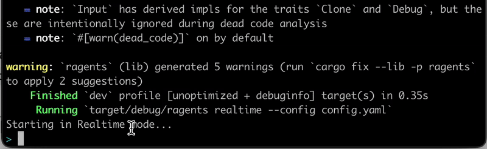

# r-agents: Build Your Own LLM Agents Without Writing Code
r-agents provide a convenient way to build your exclusive agents.

## Prepare

The library reads [API key](https://platform.openai.com/account/api-keys) from the config.yaml file `api_base` and `api_key`.

Meanwhile, there is also the proxy address of the local machine `http_port`
```bash
api_base: https://api.openai.com/v1
api_key: null
http_port: 8848
```

If you use ollama, you can set
```bash
api_base: http://localhost:11434/v1       
api_key: null
http_port: 8848
```
And you need to specify the agent description file, tool description file, and rag description file.
```bash
# ---- agent ----
agents:
  demo: src/config/agents/demo/config.yaml
  weather: src/config/agents/weather/config.yaml
  coder: src/config/agents/coder/config.yaml

# ---- rag ----
rags:
  demo: src/config/rags/demo/config.yaml
  coder: src/config/rags/coder/config.yaml

# ---- tool ----
tools:
  web: src/config/tools/web/config.yaml
  fso: src/config/tools/fso/config.yaml

```

To implement document selection, we need to set up the vector database to match the tool and document that best matches the current context.
```bash
cargo run --bin chromadb -- -t tools.yaml  -r rags.yaml
```
**Note that** you have to install the vector database locally or in docker first!

## Real-time Usage
`--config config.yaml` specifies the config configuration file.
`realtime` specifies the realtime mode you use.


```bash
cargo run --bin ragents -- realtime --config config.yaml
```



## Local Server Proxy Usage
r-agent implements agent ability through local proxy, user request LLM after being modified by the agent you are using
```bash
Chat Completions API: http://127.0.0.1:8848/v1/chat/completions
```

`--config config.yaml` specifies the config configuration file.
`serve` specifies the serve mode you use.


```bash
cargo run --bin ragents -- serve --config config.yaml
```


## Writing Your Own Agents

Building agent is remarkably straightforward. 


Create a new yaml in the [./src/agents/](./src/agents/) directory (.e.g. `demo`).

## Writing Your Own Tools

Building tool is remarkably straightforward. 

Create a new json file and an executable file in the [./src/tools/](./src/tools/) directory (.e.g. `get_current_time`).

## Writing Your Own RAG
Building rag is remarkably straightforward. 
Create a new yaml in the [./src/rags/](./src/rags/) directory (.e.g. `demo`).
